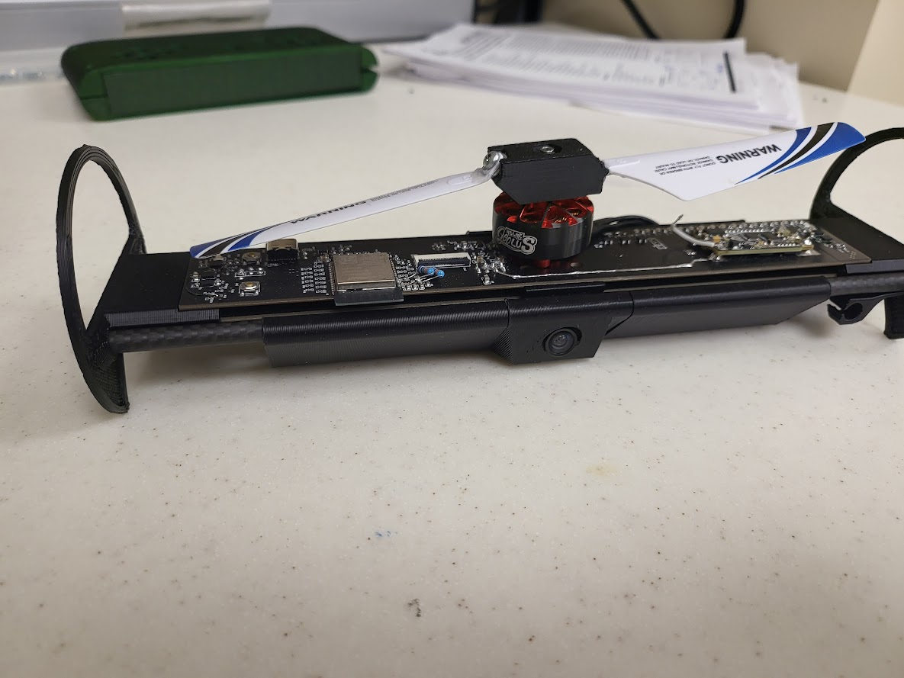
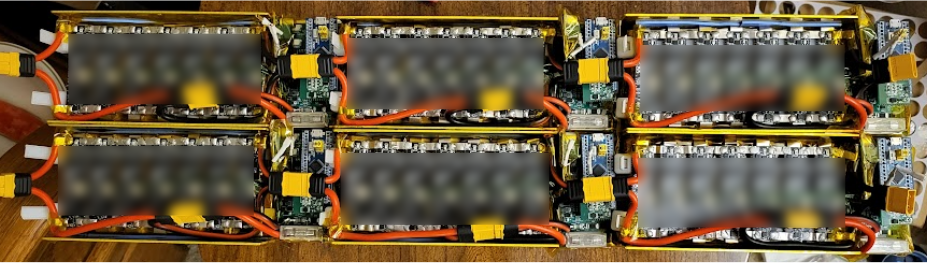
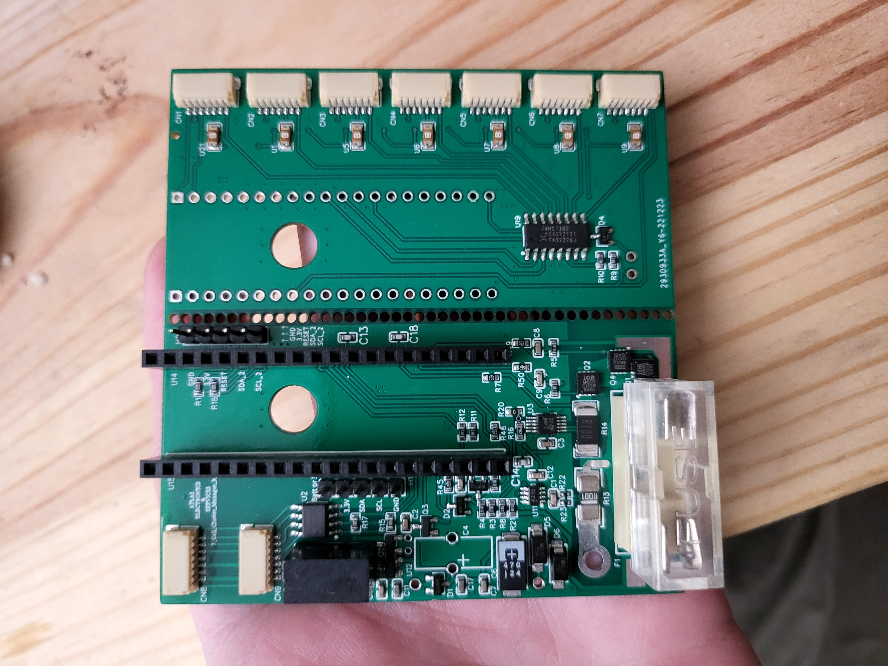
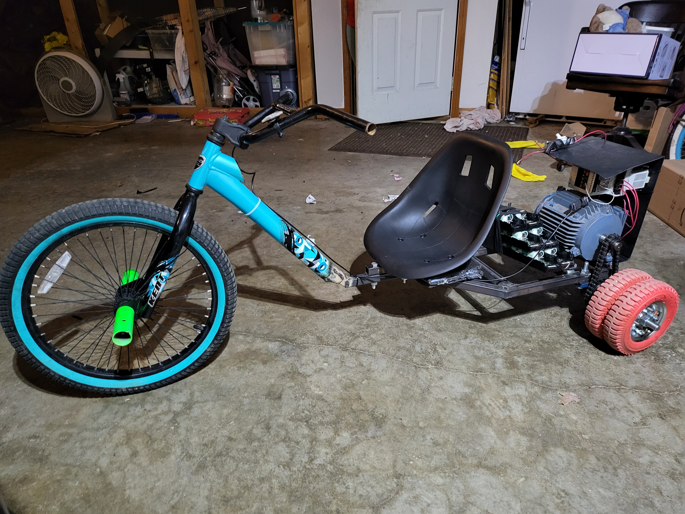
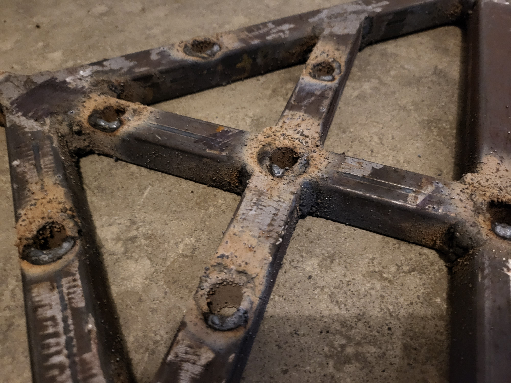
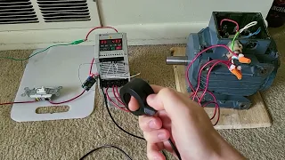

# Atlas Project Overview
This repository contains a high level summary of completed and ongoing AES projects

## Sentinel drone
### Status: Finished

The Atlas Sentinel drone is an experimental aerial drone that was used to demonstrate the capabilities of spinning drones. The drone was capable of 3 dimensional translational movement using only a single motor and rotor. This was made possible through the use of a custom made propeller that converts rotor angular acceleration into propeller pitching movements.

By adding a low frequency sine wave signal to the PWM throttle signal, the drone could effectively perform thrust vectoring and move about the XY plane. Increasing the overall throttle resulted in Z-axis altitude changes. The single rotor generated a torque that rotated the body of the aircraft in the opposite direction. This rotation was continuously integrated and checked for error to maintain a constant global direction heading. 

## Power brick
### Status: Ongoing
The power brick is a compact battery pack that can supply power equivalent to a normal 20A US power outlet. The project is devised from 3 subsystems, battery management circuitry, a bi-directional high voltage high current buck-boost converter, and a 3 phase H-bridge. When these 3 systems are combined and working in harmony, the power brick gains a large variety of function and can act as more than a silent generator. 

Some functions include but are not limited to, uninterruptible power supply, high voltage and power bench-top power supply, high voltage PWM based motor driver, high voltage 3-phase motor driver, solar charge controller, high power arbitrary waveform generator, welding machine, to name a few. Each of the 3 subsystems are critical to the devices operation but special care was given to the design of the battery management system. 

The key feature of the power brick is the ability to safely balance hundreds of cells in series in a small package.
 Most power stations use a low voltage battery pack and use switching converters to obtain a high voltage. In contrast, configuring many cells in series supplies a high voltage and low impedance, making the device very powerful and efficient. 

## The Crusader
### Status: Finished
The Crusader is the name given to an electric drift trike ([Drift Trike](https://en.wikipedia.org/wiki/Drift_trike)) that was created to act as a technology demonstrator for AES power brick. 

This trike demonstrates the capabilities of the power brick by utilizing a unique motor and drive system for such a small vehicle. The Crusader uses a 220V Allen-bradley AA08NSF1 variable frequency drive and a 2HP 3 phase induction motor for the power train. This drive system gives the trike a surprisingly strong acceleration with the ability to accelerate from 0 to 20mph in 3 seconds and a top speed of 29mph. The large induction motor gives extreme low end torque, allowing for up to 300Lb drivers, the ability to drive up steep inclines of 60 percent grade, and the ability to tow non-motorized drift trikes. The wiring harness utilizes Deutsch connectors and silicone insulated wires giving the wiring harness great water and heat resistance. The frame was constructed from 1 inch square tube steel and cylindrical galvanized steel inserts were welded into each bolt hole to prevent internal rusting. 

The frame was also built with modularity as a high priority. The trike disassembles into 3 main parts that can be quickly bolted together, the axle and bearings, the seat and motor, and the front steering column. The Crusader also acts as a template for normal passenger electric vehicle because the same battery system, motor, and variable frequency drive can just be made larger to accommodate a larger vehicle. A 25 to 50Hp induction motor and drive system would be more than sufficient for a full size passenger vehicle. 

### [powertrain video](https://youtu.be/9hJx9UgECE4?si=TxDa9L8RC-OlGwj_)

